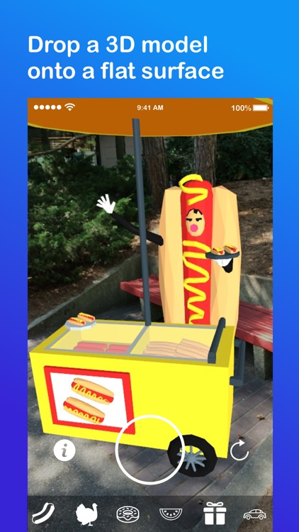

# Selfiepoop AR App Built with ARKit 1.0
Put 3D AR objects in your selfies. Wanted to make them persist but the infrastructure didn't exist. Launched end of 2017, but got removed from the app store because I forgot to renew my apple developer membership. No, it will not compile anymore. Yes, I know the name sucks. 🤷

 

